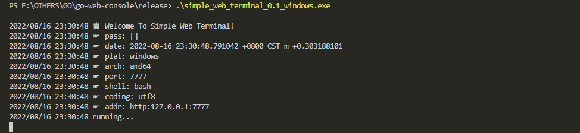
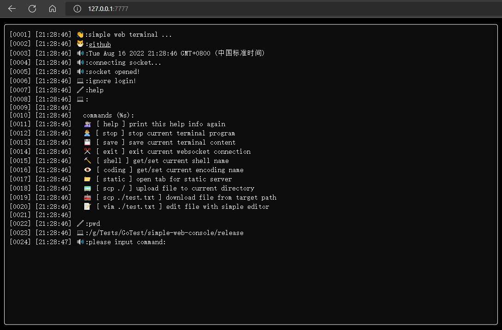
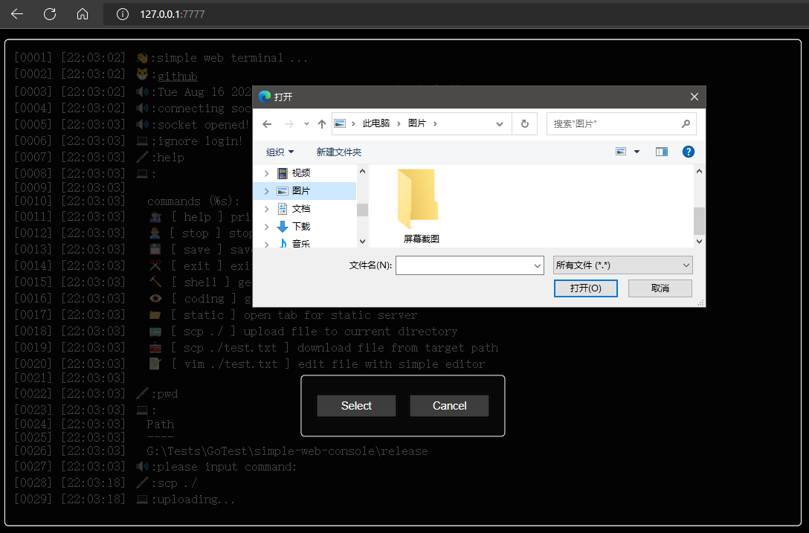
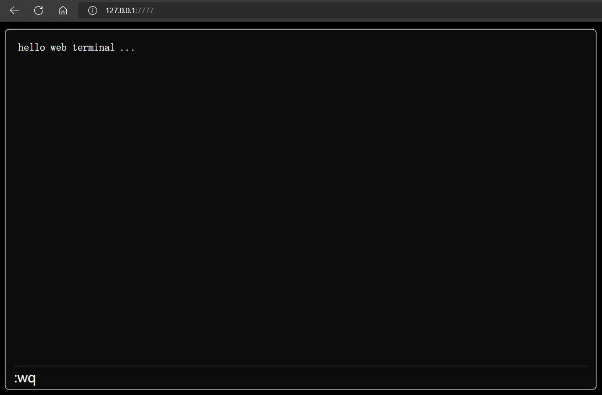
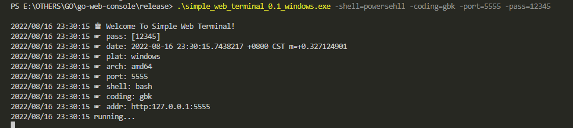
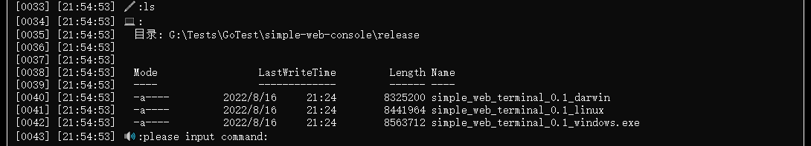

## Simple Web Terminal

> ⚠️ Don't put this program on the server until you know what you're doing, is is not safe!

### 1. About

Simple Web Terminal is a web-based terminal application, you can run this application on your server then you will be able to execute shell commands or downlaod files from a browser.

tested platforms:

* ☑ Widnows
* ☑ mac
* ☑ linux

### 2. Usage

there are standalone executable programs provided on the release page, you can download the corresponding one for you platform and double click to start it. then you will see the below log in console:

after that you can visit the terminal with your browser :

### 3. Commands

the available commands in terminal are:

* help : print help info

* stop : kill the application in server

* save : save the terminal contents in browser

* exit : close the socket between browser and serwer

* shell : set/get the current shell

* coding : set/get the current encoding of output

* static : jump to the static file server if started

* scp : upload or downlaod files

> download a file from current working directory with `scp ./test.txt`

> uplaod a file to current working directory with `scp ./` command

* vim : simple editor running in web terminal

* Other shell commands available on your server

### 4. Arguments

you can give some arguments to customize the tarminal, the supported arguments are :

* port : terminal server port (default 7777)

* shell : initial default shell(bash, sh, powershell are supported)

* coding : initial default encoding of output

* static : start a static file server (default true)

* pass : password for web terminal (default no password)

> powershell using gbk, without static server, and have password on port 5555:

### 5. Links

> this application is built with go and javascript. used resources are:

* [character-set conversion library implemented in Go](https://github.com/axgle/mahonia)

* [A fast, well-tested and widely used WebSocket implementation for Go.](https://github.com/gorilla/websocket)

* [How do I get the local IP address in Go?](https://stackoverflow.com/questions/23558425/how-do-i-get-the-local-ip-address-in-go)

* [How to generate an MD5 file hash in JavaScript/Node.js?](https://stackoverflow.com/questions/14733374/how-to-generate-an-md5-file-hash-in-javascript-node-js)

* [Using HTML5/JavaScript to generate and save a file](https://stackoverflow.com/questions/2897619/using-html5-javascript-to-generate-and-save-a-file)
